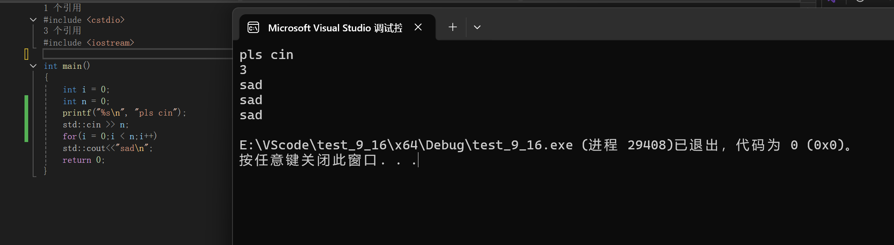

# 杂
1. 对于很短的程序，可以把一些声明或定义放在程序的开头。如果是很长的程序，把它们放在使用的位置附近，可以提高代码的可读性。


# C++概述

c起源于贝尔实验室在开发Unix操作系统时开发的一种内部实用性语言。后来在此基础上，发展出了C和C++。C比较小，主要辅助实现语言；C++很大，可以适应各种不同的场合，重要的是它支持两种非常重要的编程形式，即面向对象的编程和泛型编程。

我们常说，C++比C更好的原因是:

A. C++比C晚出现10年
B. C++的开发者比C的开发者更加优秀（bushi）
C. C++的功能更丰富
D. C++很简单

站在越多越好的普遍观点来看，C++更多的功能使它优于C。

### C++ vs java
一般认为，java把面向对象的编程做到了比C++更高的层次。
如果把二者对比

java简化了内存管理的步骤，但是效率没有C++高效

C++需要内存管理，但非常高效

## 面向对象编程（OOP）


## C++的改进
### 1. 行末注释
c语言在c99标准之前是无法在一行的末尾加注释的,只能使用
```c
/* 这是传统的块注释 */
/* 可以跨越多行
   就像这样 */

int main() {
    int x = 10; /* 也可以在代码行末尾注释 */
    return 0;
}
```
c++使用的注释风格：（c99标准之后，c语言也可以使用）
```c
// 这是单行注释
int main() {
    int x = 10; // 行末注释
    return 0;
}
```

### 2. 标准库
c的标准库在c++也通用，只不过添加方法变成了
```c
#include <stdio.h> //c
#include <cstdio> //c++
```
### 3. 预处理指令
使用#define 预处理指令可能会导致错误，而且这种属于脱离语言范畴，无法直接用语法来判断。
所以会有程序员避免使用预处理指令。
```c
#define MAX 100
const int max = 100;
```
这两行代码一个使用预处理指令，一个使用c语法，却都能达到预期的效果，而且后者属于程序的一部分，可以通过编译器的语法检查和调试发现错误

而对于宏，c++有独有一套替换方案，那就是
- inline
在函数的定义前加上inline，可以申请将此函数内联。

内联成功的直接表现无法观测，但是函数的工作逻辑发生了改变。
要知道inline的出现不仅仅解决了使用宏已出错的问题，还减轻了调用函数时的成本，这是为什么呢？

我们都知道，函数的调用需要调用栈，这一个动作就可能会消耗几毫秒的时间。inline的工作机制类似于替换，会把函数内容替换到调用函数的位置，并且属于语法系统。

这样的工作机制就节省了调用栈区的时间。但是替换只能针对于简单的内容，复杂内容也容易出错，inline只适合涵数体内代码简单的函数数使用，不能包含复杂的结构控制语句例如while、switch，并且内联函数本身不能是直接递归函数(自己内部还调用自己的函数)。

内联是以代码膨胀（复制）为代价，仅仅省去了函数调用的开销，从而提高函数的执行效率。如果执行函数体内代码的时间，相比于函数调用的开销较大，那么效率的收获会很少。另一方面，每一处内联函数的调用都要复制代码，将使程序的总代码量增大，消耗更多的内存空间。

## 4. 新增输入输出
c++还新增了一些标准库，其中还有头文件<iostream\>中的输入和输出
```c
int main()
{
	int i = 0;
	int n = 0;
	printf("%s\n", "pls cin");
	std::cin >> n; //输入到n
	for(i = 0;i < n;i++)
	std::cout<<"sad\n";//输出sad\n
	return 0;
}
```
(为什么库<iostream\>上面显示3个引用？)


我们可以拿scanf与cin对比一下，相比于scanf，cin不仅仅少了取地址，还少了输入的格式。

也就是说，cin可以知道在标准输入（一般是键盘）中，我需要什么格式的数据，通过后面的变量类型。比如n是一个int类型变量，那么cin就会认为你输入的是int类型的数据。

在c++中，程序员可以使用更加直观简单的输入输出，并且不需要担心类型安全，即数据的格式与变量类型并非符合。

## 5. 在C++中，声明和可执行语句可以混合出现
```c
// C 语言（C89/C90 标准）
void example() {
    int a;      // 声明必须在开头
    float b;    // 所有声明在一起
    char c;
    
    // 之后才是可执行语句
    a = 10;
    printf("%d\n", a);
    
    b = 3.14;
    printf("%f\n", b);
    
    // 不能在这里声明新变量
    // char d; // 错误：声明必须在可执行语句之前
}
```
```c
// C++（以及 C99 及以后的 C 标准）
void example() {
    int a = 10;           // 声明并初始化
    printf("%d\n", a);
    
    float b = 3.14;       // 在可执行语句后声明
    printf("%f\n", b);
    
    for (int i = 0; i < 5; i++) { // 甚至在 for 循环中声明
        printf("%d\n", i);
    }
    
    char c = 'A';         // 需要时再声明
    printf("%c\n", c);
}
```
这样让代码更加灵活。随之而来的还有巨大的优势：

### 5.1 提高代码可读性
```c
void processData() {
    // 先执行一些设置代码
    initializeSystem();
    
    // 需要时再声明相关变量
    DataProcessor processor(config);
    processor.loadData();
    
    // 处理过程中声明临时变量
    for (int i = 0; i < processor.count(); i++) {
        Result result = processor.processItem(i);
        // ...
    }
}
```
### 5.2 减少作用域污染
```c
void example() {
    {
        // 临时变量只在需要的作用域内存在
        TempFile temp("data.tmp");
        temp.write(data);
    } // temp 在这里离开作用域，资源被释放
    
    // 这里不能再访问 temp
    processData(); // 使用更少的内存
}
```
### 5.3 允许更自然的代码组织
```c
void calculate() {
    double input = getInput();
    
    // 在需要的地方声明中间变量
    double squared = input * input;
    
    if (squared > 100) {
        // 在条件块内声明变量
        double adjusted = squared / 2.0;
        return adjusted;
    }
    
    return squared;
}
```

## 6. 新的内存管理
回顾一下，在c语言编程，在main，或是函数里头，创建一个变量，就要在内存中划分一块空间，这块空间来自于栈区。而当不确定要一块怎样的内存时，而这块内存要参与到程序中时。我们可以向堆区中申请内存，使用完了，还给堆区。c语言中malloc()，free() 实现这些功能。

c++中，有new，delete来代替这些函数。它们并非标准库定义的函数，而是c++自带的关键字。

