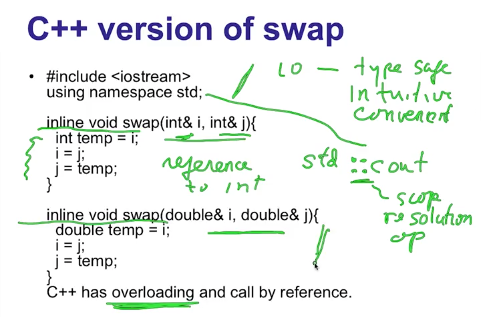
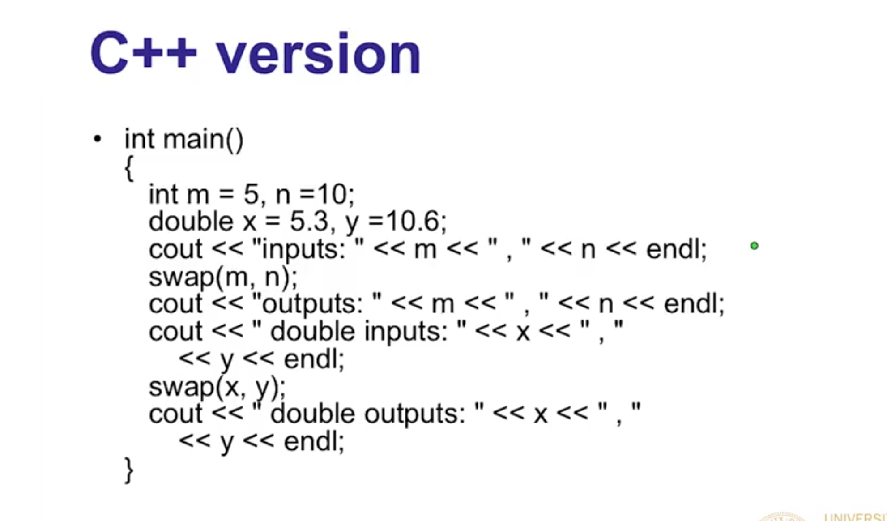
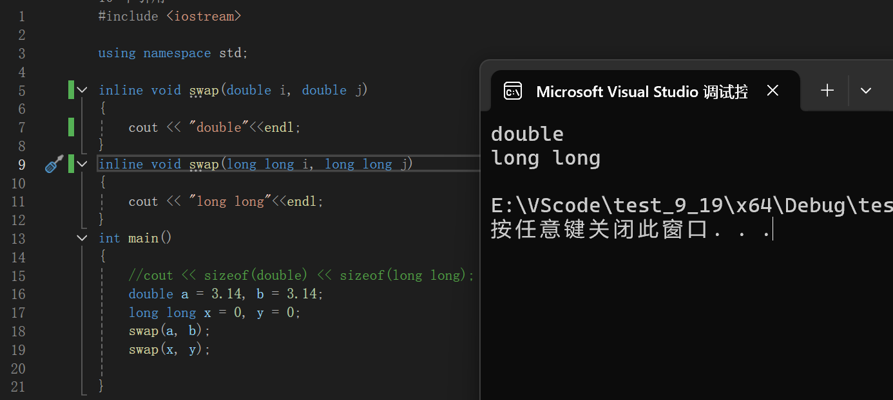
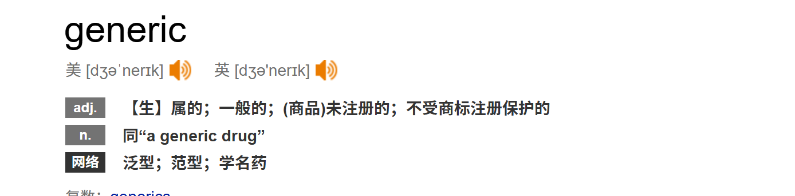

# 杂
1. 对于很短的程序，可以把一些声明或定义放在程序的开头。如果是很长的程序，把它们放在使用的位置附近，可以提高代码的可读性。
2. C


# C++概述

c起源于贝尔实验室在开发Unix操作系统时开发的一种内部实用性语言。后来在此基础上，发展出了C和C++。C比较小，主要辅助实现语言；C++很大，可以适应各种不同的场合，重要的是它支持两种非常重要的编程形式，即面向对象的编程和泛型编程。

我们常说，C++比C更好的原因是:

A. C++比C晚出现10年
B. C++的开发者比C的开发者更加优秀（bushi）
C. C++的功能更丰富
D. C++很简单

站在越多越好的普遍观点来看，C++更多的功能使它优于C。

### C++ vs java
一般认为，java把面向对象的编程做到了比C++更高的层次。
如果把二者对比

java简化了内存管理的步骤，但是效率没有C++高效

C++需要内存管理，但非常高效

## 面向对象编程（OOP）


# C++相比C的改进
## 1. 行末注释
c语言在之前是无法在一行的末尾加注释的,只能这样注释，就像下例：
```c
/* 这是传统的块注释 */
/* 可以跨越多行
   就像这样 */

int main() {
    int x = 10; /* 也可以在代码行末尾注释 */
    return 0;
}
```
c++使用的注释风格：（c99标准之后，c语言也可以使用）
```c
// 这是单行注释
int main() {
    int x = 10; // 行末注释
    return 0;
}
```

## 2. 标准库
c的标准库在c++也通用，只不过添加方法变成了
```c
#include <stdio.h> //c
#include <cstdio> //c++
```
## 3. 预处理指令的优化
使用#define 预处理指令可能会导致错误，而且这种属于脱离语言范畴，无法直接用语法来判断。
所以会有程序员避免使用预处理指令。
```c
#define MAX 100
const int max = 100;
```
这两行代码一个使用预处理指令，一个使用c语法，却都能达到预期的效果，而且后者属于程序的一部分，可以通过编译器的语法检查和调试发现错误

而对于宏，c++有独有一套替换方案，那就是
- inline
在函数的定义前加上inline，可以申请将此函数内联。

内联成功的直接表现无法观测，但是函数的工作逻辑发生了改变。
要知道inline的出现不仅仅解决了使用宏已出错的问题，还减轻了调用函数时的成本，这是为什么呢？

我们都知道，函数的调用需要调用栈，这一个动作就可能会消耗几毫秒的时间。inline的工作机制类似于替换，会把函数内容替换到调用函数的位置，并且属于语法系统。

这样的工作机制就节省了调用栈区的时间。但是替换只能针对于简单的内容，复杂内容也容易出错，inline只适合涵数体内代码简单的函数数使用，不能包含复杂的结构控制语句例如while、switch，并且内联函数本身不能是直接递归函数(自己内部还调用自己的函数)。

内联是以代码膨胀（复制）为代价，仅仅省去了函数调用的开销，从而提高函数的执行效率。如果执行函数体内代码的时间，相比于函数调用的开销较大，那么效率的收获会很少。另一方面，每一处内联函数的调用都要复制代码，将使程序的总代码量增大，消耗更多的内存空间。

## 4. 新增输入输出
c++还新增了一些标准库，其中还有头文件<iostream\>中的输入和输出
```c
int main()
{
	int i = 0;
	int n = 0;
	printf("%s\n", "pls cin");
	std::cin >> n; //输入到n
	for(i = 0;i < n;i++)
	std::cout<<"sad\n";//输出sad\n
	return 0;
}
```
(为什么库<iostream\>上面显示3个引用？)


我们可以拿scanf与cin对比一下，相比于scanf，cin不仅仅少了取地址，还少了输入的格式。

也就是说，cin可以知道在标准输入（一般是键盘）中，我需要什么格式的数据，通过后面的变量类型。比如n是一个int类型变量，那么cin就会认为你输入的是int类型的数据。

在c++中，程序员可以使用更加直观简单的输入输出，并且不需要担心类型安全，即数据的格式与变量类型并非符合。

## 5. 在C++中，声明和可执行语句可以混合出现
```c
// C 语言（C89/C90 标准）
void example() {
    int a;      // 声明必须在开头
    float b;    // 所有声明在一起
    char c;
    
    // 之后才是可执行语句
    a = 10;
    printf("%d\n", a);
    
    b = 3.14;
    printf("%f\n", b);
    
    // 不能在这里声明新变量
    // char d; // 错误：声明必须在可执行语句之前
}
```
```c
// C++（以及 C99 及以后的 C 标准）
void example() {
    int a = 10;           // 声明并初始化
    printf("%d\n", a);
    
    float b = 3.14;       // 在可执行语句后声明
    printf("%f\n", b);
    
    for (int i = 0; i < 5; i++) { // 甚至在 for 循环中声明
        printf("%d\n", i);
    }
    
    char c = 'A';         // 需要时再声明
    printf("%c\n", c);
}
```
这样让代码更加灵活。随之而来的还有巨大的优势：

### 5.1 提高代码可读性
```c
void processData() {
    // 先执行一些设置代码
    initializeSystem();
    
    // 需要时再声明相关变量
    DataProcessor processor(config);
    processor.loadData();
    
    // 处理过程中声明临时变量
    for (int i = 0; i < processor.count(); i++) {
        Result result = processor.processItem(i);
        // ...
    }
}
```
### 5.2 减少作用域污染
```c
void example() {
    {
        // 临时变量只在需要的作用域内存在
        TempFile temp("data.tmp");
        temp.write(data);
    } // temp 在这里离开作用域，资源被释放
    
    // 这里不能再访问 temp
    processData(); // 使用更少的内存
}
```
### 5.3 允许更自然的代码组织
```c
void calculate() {
    double input = getInput();
    
    // 在需要的地方声明中间变量
    double squared = input * input;
    
    if (squared > 100) {
        // 在条件块内声明变量
        double adjusted = squared / 2.0;
        return adjusted;
    }
    
    return squared;
}
```

## 6. 新的内存管理
回顾一下，在c语言编程，在main，或是函数里头，创建一个变量，就要在内存中划分一块空间，这块空间来自于栈区。而当不确定要一块怎样的内存时，而这块内存要参与到程序中时。我们可以向堆区中申请内存，使用完了，还给堆区。c语言中malloc()，free() 实现这些功能。

c++中，有new，delete来代替这些函数。它们并非标准库定义的函数，而是c++自带的关键字。

## 7.更安全的类型转换
 C 风格的类型转换 (type)expression 几乎“无所不能”，它会在运行时尝试进行任何转换，无论多么不合理。这有时会因为程序员的疏忽，导致bug。

C++提供了四种不同的更加安全的强制转换，代替C语言的强制类型转换。

老师说这意味着c的方法过时了，应该舍弃。但是我认为并不是过时，而是侧重点不一样，c的更加自由，c++的更加安全。只是对于公司来说，安全性比自由度更加重要。

C++提供的类型转换相比于C的不同在于，它会对此过程进行检查，若是此过程非常“不合理”(我觉得应该是加了一些判断)，就会直接报错。

## 课程1.6 小结
所以这一次课，提到了这几个c++相比于c的改变

1. static_cast 相比于 C 风格的类型转换，是一种更加安全、限制更多、意图更明确的类型转换。
2. 不再要求声明必须在可执行程序以前。例如在C++可以像for(   **int i = 0** ;......)这样写for循环了。
3. <<endl; 相当于在输出流输出一个换行符。使用这个的情景类似于printf("/n");。

C++的开发者或多或少地表示过这样的观点：过于纯粹或者说自由不是一件好事。我认为这是在说C语言。当然也可以是说Linux，或者映射到更大，比如纳粹纳粹和民主制度。根本上来说，对于自我，更加自由就更使我满意。但是同样站在自我的角度，会同样希望其他人更自由吗？你会希望任何人都能拥有核弹发射权吗？我觉得，希望自己自由，希望他人管控，这种思想是普遍的。所以，站在自我的角度，希望我自由的只有我，希望我管控的是除了我的任何人，如果是多数人决策，我已经要被管控了。推广到其他人，同样被管控。所以才会出现这样的思想吗？那么如果我们都希望其他人过得更好，那么所有人不都可以生活在一个美好的社会了吗？

当然他还说过:java是纯粹的对OO的模拟。所以Java也不被他认可吗？这样看来我的猜想有过度解读之嫌。

他还说：C++唯一优势在于它支持几种编程风格，几种范式等等。

## 课程1.7 《C++优于C》
为什么C++要更好？
### C++有更好的类型安全型
C语言在被丹尼斯里奇创造之初，是为了辅助Unix操作系统的开发。他们经常通过类型转换或者让类型被编译器视为另一种类型，并且他们清楚怎样是安全的。

但是对于大型的多人开发项目来说，一个类型的不安全转换，导致程序出现bug，而且它无法被编译器抓取，这对于bug修复人员是非常的抓狂的。

所以，如果不安全的类型转换能被编译器抓取并限制，对于项目开发无疑是巨大的优势。

### C++提供了更多的函数库
为什么要使用函数库？

1. 函数库久经考验，不需要担心bug。
2. 提供了极高的代码复用性

并且，C++新增了STL (标准模板库)。

### C++减少了预处理器的重要性
C++中预处理主要是去包含函数库。而在C语言中，还会使用#define 去定义符号或者宏。

但是，软件工程学研究表明，预处理器它不会根据上下文遵守语法规则，仅仅只是进行文本替换，这会制造许多bug。因此在C++程序员眼中，使用#define成为了不好的习惯。

而C++可以使用效果相同，而且是由语言本身提供的，能被语法检查的替代物。这也是C++的一大改进。

### C++自诞生之初，就更贴合OO
虽然C++一开始并没有考虑这方面，但是在长时间使用后，人们发现C++中面向对象的范式对于大型项目开发是至关重要的。(所以之后也被加入到C语言中了)

## 具体落实到语法，就是

- inline，const
- static cast<type>
- 
### inline，const替换了#define宏 和重定义符号
被inline修饰的函数，就像对编译器说，请保持我的全部语义，同时请尽可能避免函数调用的开销。

而const修饰的变量，达到全局作用域同时，也保持不变性，最重要的是可以被编译器语法检查。

### namespaces
有关封装的一个东西。随着项目的体量越来越大，封装的重要性逐渐凸显出来。所谓封装，就是把各各功能或者对象模块化。比如A*B，意思是A和B相乘。封装就是把乘这个动作提取出来。

也就是从A*B，变成了使用乘这个动作，第一个对象是A，第二个是B。

这样做的好处在于，以后如果需要A*C，就不需要重新写，直接把乘这个动作的第二个对象改成C。

同时，如果程序出现bug，我们只需要修改A，*，B中有bug的部分就可以，而不需要全部推倒重来。

## 课程1.8 《C交换功能》
怎么用C写一个能交换两个变量的值的功能？

显然，我们需要改变变量的内容，所以一定是使用指针进行操作。

C的指针是一块很复杂的知识，因为内存中每一个字节的数据都可以分配一个地址，同时根据不同指针指向的数据的不同，访问权限也不同。

而C++中简化了指针的操作。并且可以很容易实现C中的复杂功能。

为什么说C会复杂呢？比如置换函数，我这次想置换int类型，函数就会是以int \*去接收，double则用，double \*。如果想能接收任何类型，一般是用char*来接收，然后再传一个变量以表示要交换多少个字节。是不是很麻烦。

## 1.8 小结
看来C语言中的格式化io(I/O（英语：Input/Output），即输入/输出)，因为格式由程序员自由决定，所以存在类型安全问题。

并且因为C指针的复杂性，C++对指针操作进行了简单化。具体是怎么样的呢？以后会为我揭晓吧。

## 课程1.9 《C++的交换函数》
好的，这节课老师要说服我C++版本的交换函数要好得多。

我觉得作为入门课程，现在的目标是把大概的模块过一遍，所以不用太深究语法，而应该去思考这样变化的意义。

namespaces一般用途类似于typedef，可以把很长的修饰化简。

C++使用更好的IO。

然后C++有内联函数，效率高一些。

C++的函数参数中写了这样的东西：" int& i "。这应该读作对i的引用，而不是i的值。这个函数在调用时，它们应该会自动在调用函数的域寻找这两个变量，而不用拷贝。

这意味着，函数可以直接对本地变量进行修改。同样的，它不会花费拷贝变量的开销，从而提高效率。然后也使我们想让函数可以修改本地变量时，不必再取地址解引用了。

最震撼的是，C++竟然可以允许两个函数同名，而不会导致歧义。原因是C++有重载这个步骤，当函数名有同名的情况，就会进一步通过类型进行匹配算法来确定应该重载哪一个函数。

所以为了避免歧义，同名函数应该保证类型或者参数数量不相同。

重载似乎不仅仅作用于函数名，比如"<<"本来应该表示左移，可以在输出cout中却是另一个意思。

让我们看看主函数，


对于io，不需要格式化，是什么类型就以什么类型输入/输出。
Q: 是不是意味着可以通过某些方式确定类型？

对于函数，同一个函数名会根据传入参数的不一样，调用不同的函数。对于代码的读者来说，一眼就能看出来这个函数的功能，对于代码的作者来说，没必要再使用其他函数名。



## 1.9 小结
主要介绍了c++可以通过识别标签（函数名，类型），来实现重载，在函数最常用到重载。

C++的函数参数中写了这样的东西：" int& i "。它们应该会自动在调用函数的域寻找这两个变量，而不用拷贝。

## 课程1.10 《种非专利药》

去看医生时，经常会被这样告知：买一些非专利药吧。因为专利药作用面广，并且很便宜。

### 什么是泛型？

### 为什么泛型？
为了得到普遍性的规律。比如做鱼肉有鱼肉的菜谱，猪肉有猪肉的菜谱，牛羊肉有牛羊肉的菜谱，那么与其买若干本不同的菜谱，不如总结出使用于肉类的食谱。

所以泛型的最大优势：通用性。

### 怎么泛型？
通用术语中泛型在C++里面指的是，模板程序 使用模板编程。 而对类属编程(Generic programming) 特别是其在社区应用方面 做出了较大影响的人 就是亚历山大 斯特潘诺夫(STL之父)。

历史上也存在非常适合泛型编程的语言，比如AI语言Lisp。 Lisp在某些方面是没有类的语言 所以编程者需要确定 他们能正确地操控所有对象 这样才能不会在类别上出错。 才可以写出应对任何事的代码来。 Lisp具有如此精妙的数据结构，链表被整合其中， 你可以在 这些链表中做许多运算和数据存储。 因此，它是很强大和很具体的语言。 在AI领域Lisp应用广泛，而它诞生于 二十世纪60年代，由天才的John McCarthy发明。 于是人们真的想要在别的语言，比如C中得到这些优势。

但是，c语言的底层逻辑注定了它并不是很适合泛型编程。如果要在c语言中用类似Lisp的方式实现泛型，就得牺牲一定的底层的效率。

那么怎么在保证效率的情况下，还能实现通用性呢？

### template <class 标识符>
假如我已经写下来了这样一行代码：
```c
template<class T>
```
这是什么，怎么使用？
随便写一个函数：
```c
void swap(int a, int b)
{
    
}
```
